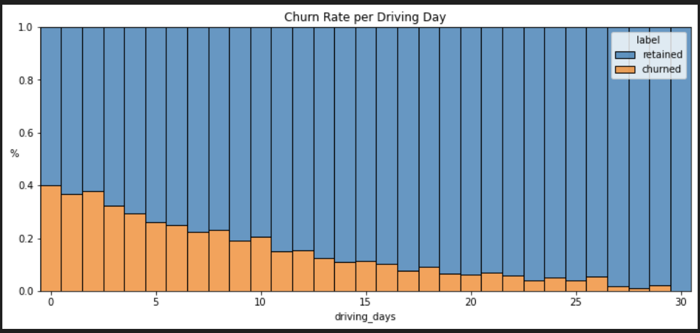
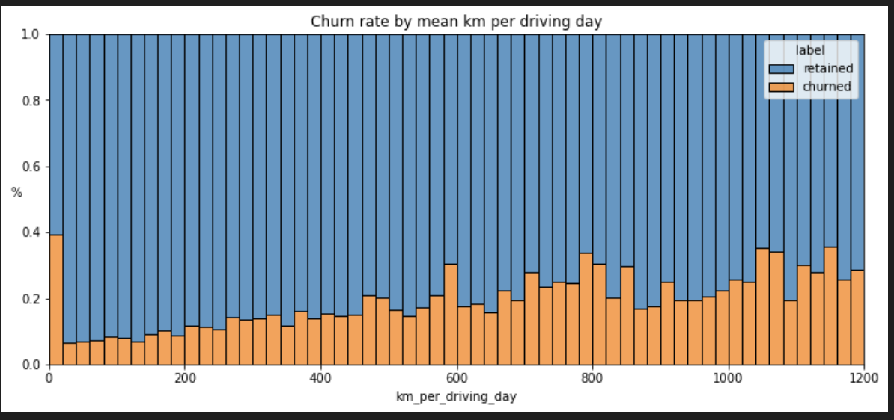
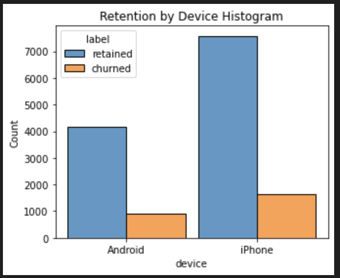

# WazeChurnModel
A machine learning model to predict user churn on Waze. Part of the Google Advanced Data Analytics Certificate.

## Project Overview:

The Waze data team is currently developing a data analytics project aimed at increasing overall growth by preventing monthly user churn on the Waze app. Thorough exploratory data analysis (EDA) enables Waze to make better decisions about how to proactively target users likely to churn, thereby improving retention and overall customer satisfaction.

## BLUF: Bottom Line Up Front
 * The more times users used the app, the less likely they were to churn. 

 * Distance driven per driving day had a positive correlation with user churn.

 * Number of driving days had a negative correlation with churn.

## Details

 * Users of all tenures from brand new to ~10 years were relatively  evenly represented in the data.
 * Nearly all the variables were either very right-skewed or uniformly distributed.
 * Several variables had highly improbable or perhaps even impossible outlying values, such as: driven_km_drives, activity_days and driving_days.

 
 * The churn rate is highest for users who didn't open Waze much in the past month.
 * While 40% of the users who didn't use the app at all last month churned, nobody who used the app 30 days churned.
 * Users who drove more days of the last month were less likely to churn.

  
 * Churn was inversely correlated with how much people drove.
 * The farther a user drove on each driving day, the more likely they were to churn.

 
 * There seemed to be no difference based on device.

## Next Steps:

* Investigate the erroneous or problematic discrepancies between number of sessions, driving_days, and activity_days.
* Continue to explore user profiles with the greater Waze team; this may glean insights on the reason for the long distance drivers’ churn rate.
* Plan to run deeper statistical analyses on the variables in the data to determine their impact on user churn.

